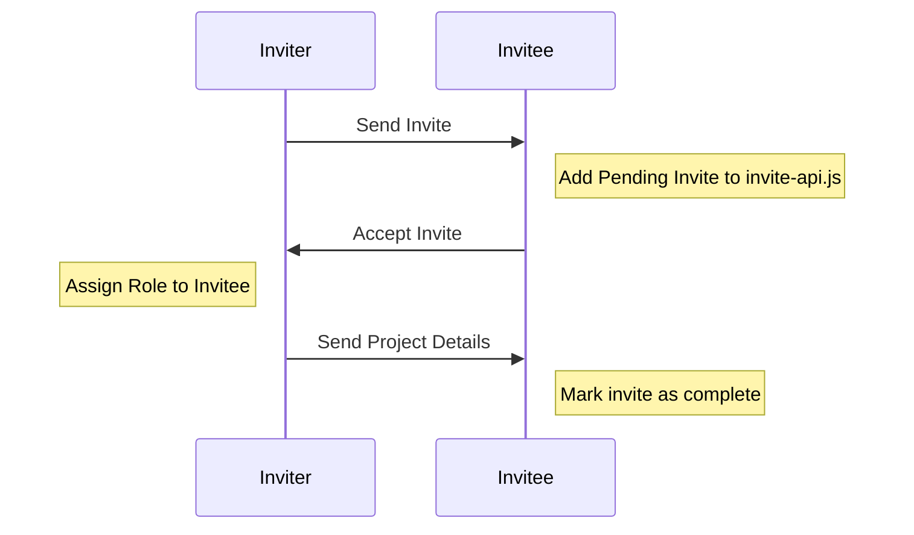

# Project Invites

Onboarding peers onto your project is facilitated by the invites system.

```mermaid
sequenceDiagram
   participant Inviter
   participant Invitee
   Inviter->>Invitee: Send Invite
   Note right of Invitee: Add Pending Invite to invite-api.js
   Invitee->>Inviter: Accept Invite
   Note left of Inviter: Assign Role to Invitee
   Inviter->>Invitee: Send Project Details
   Note right of Invitee: Mark invite as complete
```