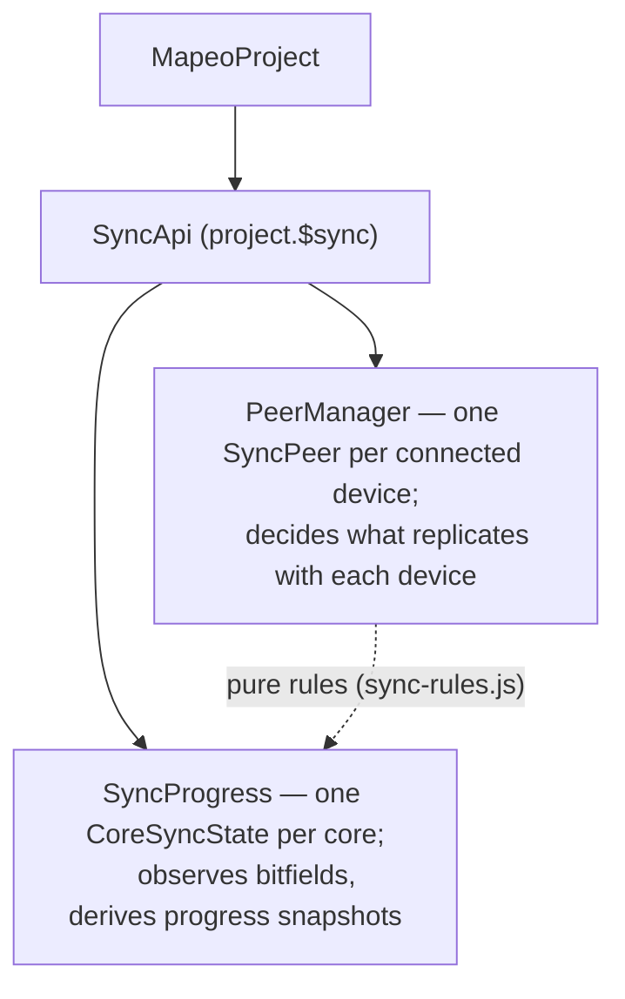

# Sync

How synchronization works between devices in a project.

## Components

## How it works

- Peers are found via multicast UDP and tracked via `local-peers.js`.
- Every connected peer replicates the project creator core; the resulting
  `peer-add` event is what registers a device with the sync subsystem.
- Cores are grouped into two namespace groups: **initial** (`auth`, `config`,
  `blobIndex`) syncs whenever a peer is connected; **data** (`data`, `blob`)
  syncs only while data sync is started, and with a given peer only once
  initial sync with that peer is complete.
- What may sync with a peer is governed by the peer's role (its per-namespace
  sync *capability*); what is currently syncing is governed by the device's
  *sync mode* (`stopped` / `initial` / `all`).
- Progress and completion are derived from core bitfields (plus "pre-have"
  extension messages that advertise what a peer holds before replication
  starts) into a single snapshot; all completion questions are answered by
  shared predicates over that snapshot.

For the full design — vocabulary, state shape, completion semantics, and the
reasoning behind the architecture — see the redesign proposal in
[PR #1304](https://github.com/digidem/comapeo-core/pull/1304); the bugs in
the previous design that motivated it are collected (with failing
reproductions) in [PR #1303](https://github.com/digidem/comapeo-core/pull/1303).
