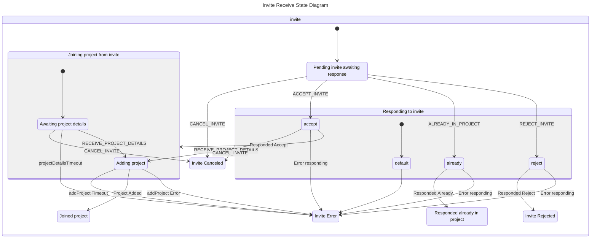

```mermaid
---
title: Invite Receive State Diagram
---
stateDiagram-v2
  state "invite" as invite {
    [*] --> invite.pending
    invite.pending --> invite.canceled : CANCEL_INVITE
    invite.pending --> invite.responding.accept : ACCEPT_INVITE
    invite.pending --> invite.responding.already : ALREADY_IN_PROJECT
    invite.pending --> invite.responding.reject : REJECT_INVITE
    invite.responding.default --> invite.error
    invite.responding.accept --> invite.joining.addingProject : RECEIVE_PROJECT_DETAILS
    invite.responding.accept --> invite.joining : Responded Accept
    invite.responding.accept --> invite.error : Error responding
    invite.responding.reject --> invite.rejected : Responded Reject
    invite.responding.reject --> invite.error : Error responding
    invite.responding.already --> invite.respondedAlready : Responded Already
    invite.responding.already --> invite.error : Error responding
    invite.responding --> invite.canceled : CANCEL_INVITE
    invite.joining.awaitingDetails --> invite.canceled : CANCEL_INVITE
    invite.joining.awaitingDetails --> invite.error : projectDetailsTimeout
    invite.joining.addingProject --> invite.error : addProject Timeout
    invite.joining.addingProject --> invite.joined :  Project Added
    invite.joining.addingProject --> invite.error : addProject Error
    state "Pending invite awaiting response" as invite.pending
        state "Responding to invite" as invite.responding {
            [*] --> invite.responding.default
            state "default" as invite.responding.default
            state "accept" as invite.responding.accept
            state "reject" as invite.responding.reject
            state "already" as invite.responding.already
        }
        state "Joining project from invite" as invite.joining {
            [*] --> invite.joining.awaitingDetails
            invite.joining.awaitingDetails --> invite.joining.addingProject : RECEIVE_PROJECT_DETAILS
            state "Awaiting project details" as invite.joining.awaitingDetails
          state "Adding project" as invite.joining.addingProject
        }
    state "Invite Canceled" as invite.canceled
    state "Invite Rejected" as invite.rejected
    state "Responded already in project" as invite.respondedAlready
    state "Joined project" as invite.joined
    state "Invite Error" as invite.error
  }

```
