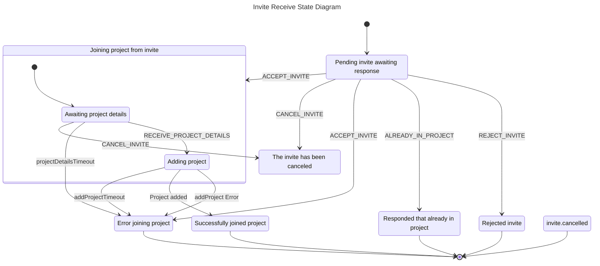

```mermaid
---
title: Invite Receive State Diagram
---
stateDiagram-v2
  [*] --> invite.pending
  invite.pending --> invite.canceled : CANCEL_INVITE
  invite.pending --> invite.joining : ACCEPT_INVITE
  invite.pending --> invite.error : ACCEPT_INVITE
  invite.pending --> invite.respondedAlready : ALREADY_IN_PROJECT
  invite.pending --> invite.rejected : REJECT_INVITE
  invite.joining.awaitingDetails --> invite.canceled : CANCEL_INVITE
  invite.joining.awaitingDetails --> invite.error : projectDetailsTimeout
  invite.joining.addingProject --> invite.error : addProjectTimeout
  invite.joining.addingProject --> invite.joined : Project added
  invite.joining.addingProject --> invite.error : addProject Error
  state "Pending invite awaiting response" as invite.pending
      state "Joining project from invite" as invite.joining {
          [*] --> invite.joining.awaitingDetails
          invite.joining.awaitingDetails --> invite.joining.addingProject : RECEIVE_PROJECT_DETAILS
          state "Awaiting project details" as invite.joining.awaitingDetails
          state "Adding project" as invite.joining.addingProject
      }
  state "The invite has been canceled" as invite.canceled
  state "Rejected invite" as invite.rejected
  state "Responded that already in project" as invite.respondedAlready
  state "Successfully joined project" as invite.joined
  state "Error joining project" as invite.error
  invite.cancelled --> [*]
  invite.rejected --> [*]
  invite.joined --> [*]
  invite.error --> [*]
  invite.respondedAlready --> [*]

```
